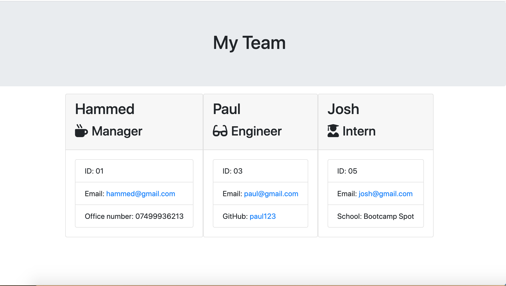

# Team_Info_Gen

Team_Info_Gen is a team profile generator that runs on the CLI and was designed using Node.js, inquirer and jest.

## Table of Contents:

1. [Description](#description)
2. [Installation](#Installation)
3. [Usage](#Usage)
4. [Contributing](#Contributing)
5. [Tests](#Tests)
6. [License](#License)
7. [GitHub](#GitHub)
8. [E-mail](#E-mail)

## Description

Team_Info_Gen is a CLI Application that can be used to generate team profile. This project was built using Nodejs, OOP and TDD (Jest). It prompts user with questions about the team to generate an HTML page for in the terminal and use the answers provided to generate HTML page.

## Installation

- NodeJs
- Inquirer
- jest

## Usage

- Install NodeJs on your local machine.
- Clone this repository to your local machine
- Run "npm install" or "npm i" on your "terminal" or "git Bash" to install all the packages used in this project.
- Run "npm run test" on your "terminal" or "git bash" to see the result of the TDD using jest.
- Run "node index.js" or "node index" on your "terminal" or "git bash" to run the application.
- Provide answers to the questions prompted on the terminal and once your done you can use the arrow keys on your keyboard to point "Finish building the team" and press "Enter" key to to generate an HTML page in an "output" folder.

Here is the screenshot of the rendered page

## Contributing

You can contribute buy reaching out to me on Github at "https://github.com/hoduola5/Team_Info_Gen".

## Tests

TDD was done using jest.

## License

Please see the LICENSE on the README.md file.

## GitHub

https://github.com/hoduola5

## E-mail

hoduola5@gmail.com
